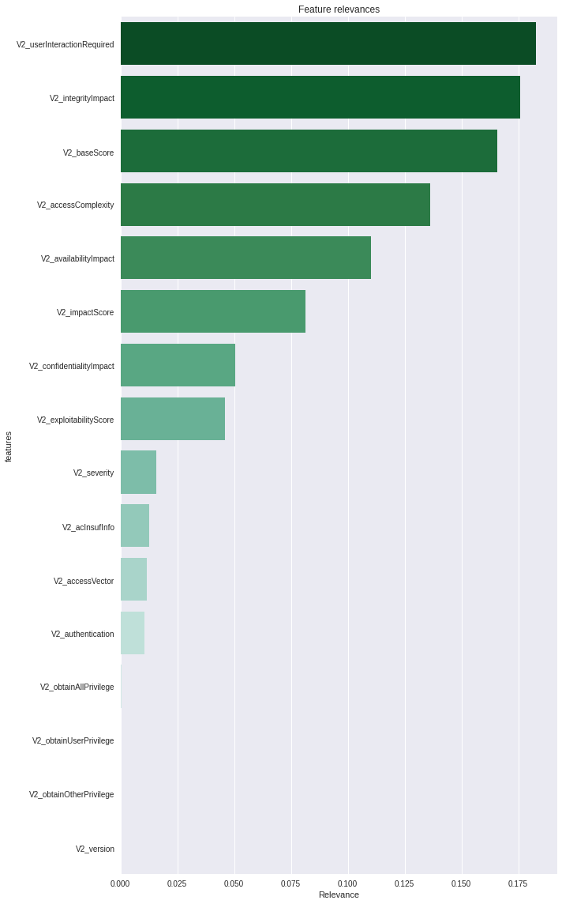

# csvv_experiments

## Dataset
Of all CVEs downloaded from https://nvd.nist.gov/vuln/data-feeds#JSON_FEED, we have 151637 of those which have CVSSv2 metrics, 
and of those, only 78264 have CVSSv3 metrics

## Goal
The goal is to be able to predict several values for CVSSv3 for the CVEs that do not have them defined, from the existing CVSSv2 values.

A direct mapping of values is not possible, given that the matches are not unique:

### Predictive models
Since we will be using predictive models, we need to set up the training so that the end predictions make sense.

For this, we select as input variables only those of V2, since they are the only ones that are defined for the CVEs that we want to predict. Of those, we ignore the 'V2_vectorString' variable, since it is reflected in the others, and only adds complexity to the models.

Of the remaining entries, we split them into 70% for training and 30% for testing, to see how we perform when the CVSSv3 values exist, and assuming the predictive models generalize (this is done through checking whether they have a good accuracy, while not overfitting.

### Predicting V3 Scope
Using a Random Forest Classifier, we obtain an 88% balanced accuracy in test (with a 30% test partition), which implies that for the two possible outcomes (UNCHANGED and CHANGED) we get an average of 88% recall.

After trying other models, including Neural Networks and linear models, the result of the Random Forest was still the one on top.

The feature relevances for the Random Forest are:

The generated metric predictions are stored in the `results/scope_results_rf.csv` file.

### Predicting other V3 metrics
When predicting other metrics: confidentiality, availability and integrity; we observe than there are three outcomes, instead of two.
Similarly to the previous section, we predict it with a RandomForest.

Confidentiality and integrity perform reasonably well, but availability only has a balanced accuracy of 67%. To try to solve this (which is due to class imbalance), we train the model by balancing each class. By doing this, we manage to obtain the following results:

The generated metric predictions are stored in the `results/cia_results_rf.csv` file.

## Improvements to be made
* Other models could be trained giving more relevance to the CVEs that fail, as well as further data analysis, seeing variable distributions for the correctly predicted classes against the incorrect ones, to see if there is some kind of domain shift that could translate into better predictions